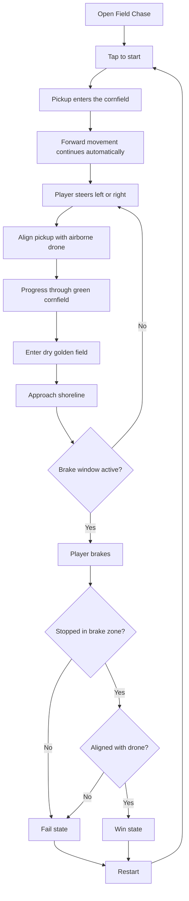
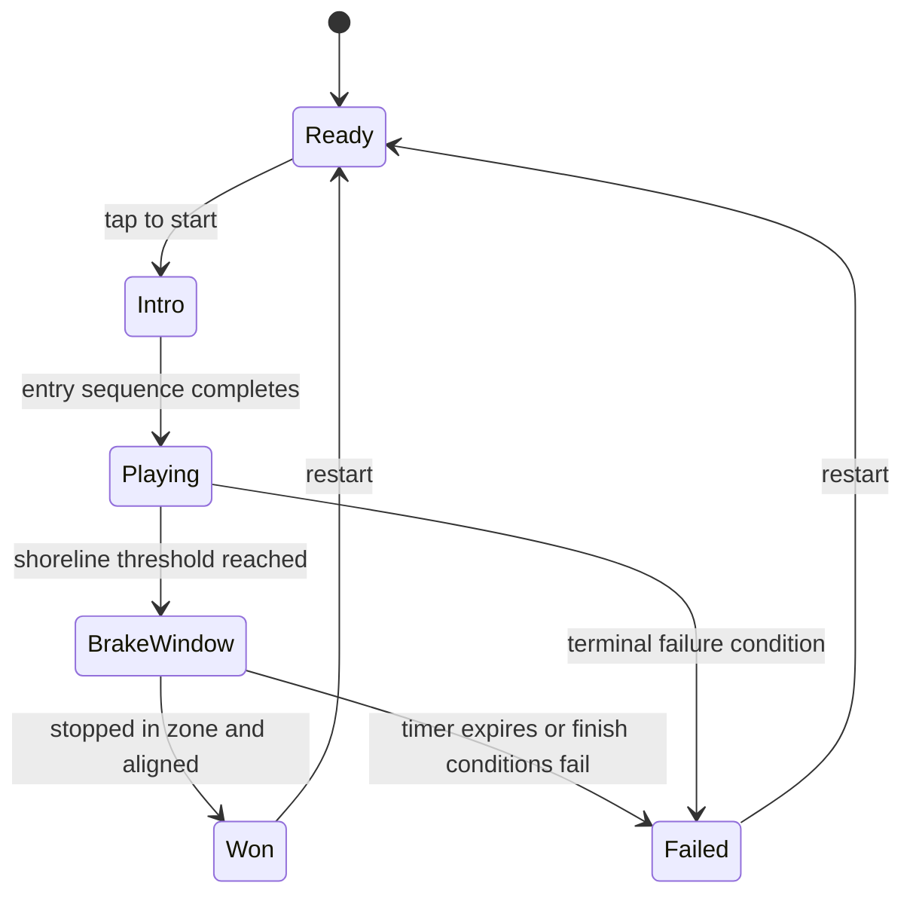
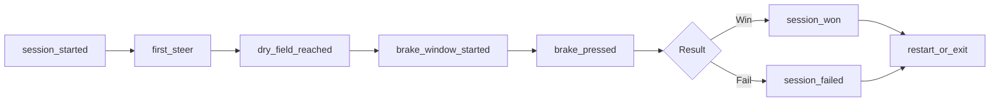

# Field Chase gameplay workflow

## Player journey

## Game-state model

## Product instrumentation candidates

These are proposed analytics events, not current implementation requirements.

Useful event properties could include session duration, steering corrections, alignment error, brake timing, device type, viewport size, and retry count.
