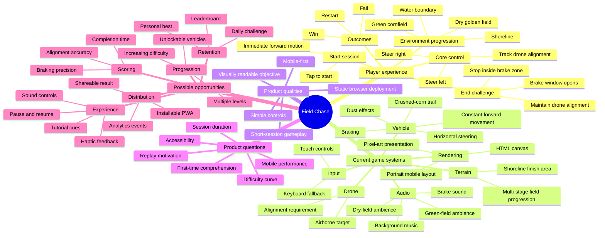

# Field Chase product mind map

## Reading the map

- **Current game systems** describes capabilities visible in the repository today.
- **Product questions** identifies areas to validate through playtesting or analytics.
- **Possible opportunities** is an idea backlog, not a statement of implemented functionality.
