# Field Chase proposed product roadmap

This is a planning aid. It does not assert that the proposed items are committed or scheduled.

```mermaid
flowchart LR
    subgraph NOW[Now - clarify and stabilise]
        N1[Document current game loop]
        N2[Define win and fail conditions]
        N3[Test mobile controls]
        N4[Check loading and audio behaviour]
        N5[Establish baseline analytics]
    end

    subgraph NEXT[Next - improve the core loop]
        X1[Add clearer tutorial cues]
        X2[Balance steering and braking]
        X3[Add score and personal best]
        X4[Improve restart flow]
        X5[Add sound and accessibility controls]
    end

    subgraph LATER[Later - expand retention]
        L1[Multiple levels]
        L2[Difficulty progression]
        L3[Daily challenge]
        L4[Shareable results]
        L5[Installable PWA]
    end

    NOW --> NEXT --> LATER
```

## Suggested decision gates

| Gate | Question | Evidence |
|---|---|---|
| Core comprehension | Do new players understand steering, alignment, and braking? | Observed playtests and completion funnel |
| Control quality | Do touch controls feel predictable across common phones? | Device testing and steering-error data |
| Challenge balance | Is the final brake sequence demanding but learnable? | Win rate, retries, and brake-timing distribution |
| Replay value | Do players voluntarily start another session? | Restart rate and repeat-session rate |
| Expansion readiness | Is the core loop strong enough to justify levels or social features? | Retention and qualitative feedback |

## Prioritisation principle

Prefer changes that improve understanding, control quality, and the win/fail loop before adding progression or social systems.
